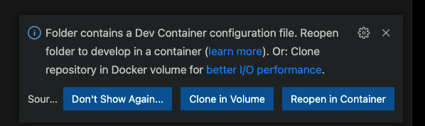

# serverless-offline-template
`docker` development `environment` template repo with `serverless-offline` used to serve and develop `lambda` functions locally inside a container

### setup
* install Docker Desktop (https://www.docker.com/products/docker-desktop)
* install Remote Containers (https://code.visualstudio.com/docs/remote/containers)
* run `setup.sh` in terminal of project root
* open project in `vscode`
* `vscode` will prompt you to open Dev Container (Click Reopen in Container) 

### templating project
this repo is a `template` repo meaning that you can `clone` this repo and re-name it at the same time
```
git clone https://github.com/rootRaider/serverless-offline-template {YOUR_REPO_NAME}
```
next rename the service on `serveless.yml` line 1 and `WORKDIR` on `Dockerfile` line 3 to match your project and `repo` name respectively

### accessing the container
from `terminal` at root of project:
```
# list docker processes
docker ps

# grab container id and start terminal session
docker exec -it {CONTAINER ID} sh
```
from `vscode`
* click `Terminal -> New Terminal` within `vscode` and a new `terminal` session within the `container` will be opened

### starting the server
* inside the `terminal`:
```
npx serverless offline
```

### stopping the server
* `ctrl^c` inside the `terminal` will halt the server

### accessing the lambda
Their exists a built-in `lambda` function acccesible at `http://localhost:9999/dev`
If the page loads then the project is `setup` successfully
